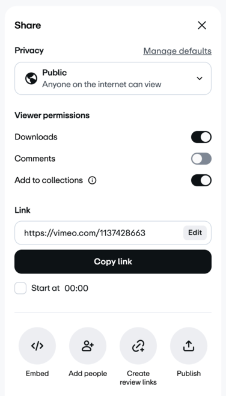
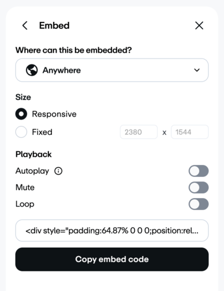

# Vimeo Embeds
Generate Vimeo embed code to work on Beehiiv (web &amp; email), with clickable thumbnail as fallback.

**To obtain the original embed code by Vimeo:**

1. Sign into Vimeo (account that uploaded the video)
2. Go manage a video (the url is similar to `https://vimeo.com/manage/videos/VIDEO_ID_HERE`)
3. Open the **Share** widget (make sure it’s public)  
4. Click on the **Embed** option (make sure it’s responsive)  
5. Copy the code and paste it in [our tool](https://openvisualizationacademy.github.io/vimeo-embeds/)

